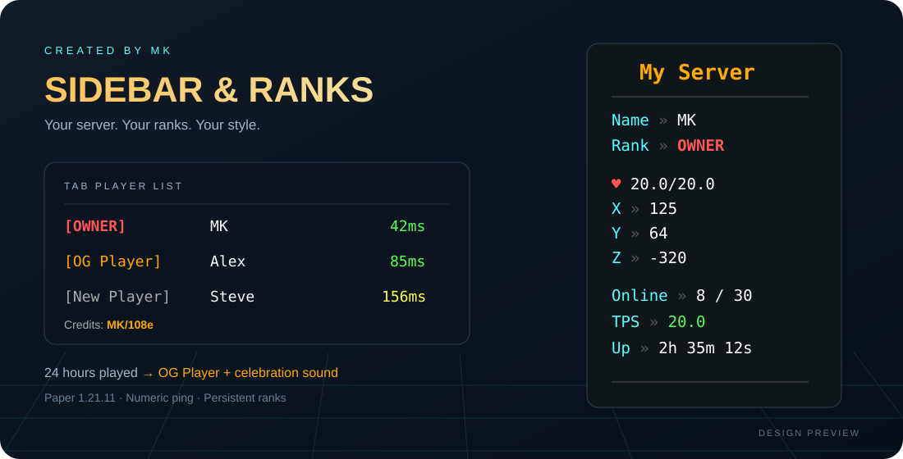
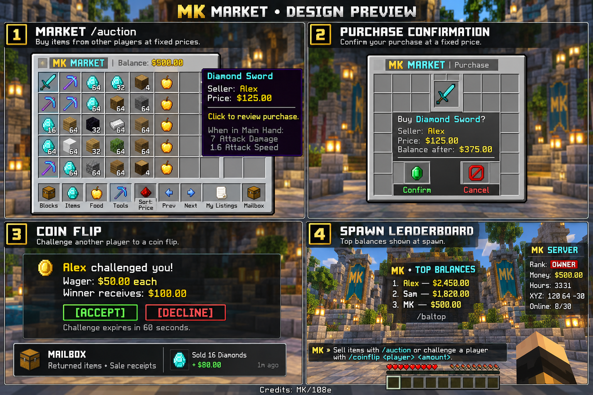

# MK Sidebar & Ranks

**Your server. Your ranks. A sidebar worth showing off.**

A standalone plugin for **Paper 1.21.11 · Java 21**, created by **MK**. Compact sidebar rows, colored rank badges, ping, playtime promotions, an in-game wallet, fixed-price item market, player coin flips and a spawn money leaderboard. No companion plugins or client mods required.



[Download the plugin](https://github.com/MKonline08/mk-sidebar-ranks/releases/latest) · [Placeholders](docs/PLACEHOLDERS.md) · [Configuration](src/main/resources/config.yml) · [Validation](docs/VALIDATION.md)

**New in v1.5.0:** everyone gets a one-time **$500** wallet; `/auction` browses fixed-price listings with purchase confirmation, category/price filters and an offline item mailbox. `/money history` shows sale receipts and transactions, `/coinflip` offers equal-stakes player challenges, and `/baltop` shows the richest players. Admins can add/remove money and place/remove a persistent spawn leaderboard. Configurable chat reminders advertise the market and coin flips. All features live in this one jar. See [market instructions and commands](docs/MARKET.md).



The image is a design concept. Actual interfaces use native Minecraft inventory slots, item tooltips and chat, with gold/aqua styling.

## Install

1. Download **`mk-sidebar-ranks-1.5.0.jar`** from the release page.
2. Stop your Paper 1.21.11 server and replace the old MKSidebarRanks jar in **`plugins/`**. Install only one version.
3. Keep the **`MKSidebarRanks`** folder when upgrading. Start the server; older configurations are backed up and new settings are added while preserving custom values.
4. Run **`/mkrank set YourMinecraftName owner`** after you have joined. Your OWNER label will be bold red in your sidebar and Tab.

The label does not make someone an operator or grant permissions. Keep using your existing server permissions for administrative access.

## What players see

- A right-side sidebar showing **server name, player name, rank, health, coordinates, hours played, money, online count, TPS, and uptime**.
- Colored rank badges beside usernames above players' heads, such as **`[OWNER] MK`**. The rank badge uses its configured color and bold setting; the username stays white.
- Tab entries such as **`[OWNER] MK • 42ms`**, with rank colors and green/yellow/red numeric ping.
- **New Player** on first join, then **OG Player** after **24 total connected hours**, including time spent AFK.
- A server-wide chat announcement when someone earns OG. Existing recorded Minecraft playtime counts once on first join after installation.

Sidebar refreshes are queued roughly once per second and spread across ticks. Tab ping refreshes every five seconds by default; rank/name changes bypass that delay. Manually assigned OWNER and custom ranks stay protected from automatic promotion. Names, playtime, earned ranks, manual ranks, and sidebar preferences survive restarts.

**New in v1.2.0:** cached display rows, selective placeholder reads, shared server-stat snapshots, bounded update batches, throttled Tab ping updates, and saves limited to changed player records. The compact layout, celebration sound, and **Credits: MK/108e** Tab footer remain included.

**New in v1.2.1:** manual rank assignments and resets play the configured celebration sound for every online player when the effective rank changes. Reassigning the same rank is silent. Offline assignments sound for the current online audience, with no replay when the target joins. A reset that earns OG plays the automatic promotion sound once.

**New in v1.3.0:** overhead rank badges and a compact **Hours** row. Badges follow automatic promotions, manual assignments, custom colors, joins, and restarts. Hiding the sidebar keeps overhead badges active. Unchanged badges send no repeated team updates.

**New in v1.3.1:** if multiple saved UUID records share a username, `/mkrank set`, `/mkrank reset`, and `/mkrank info` choose the currently connected player when given that name. Old records remain saved. For an ambiguous offline name, specify the exact UUID.

**New in v1.4.0:** manual assignments and resets broadcast **RANK CHANGE! PlayerName is now RankName!** after saving. `/rank` shows your rank, hours, and progress toward OG. Administrators can use `/mkrank testsound` to test the configured celebration sound without changing ranks.

### Update from an earlier version

Stop the server, replace the old plugin jar with v1.5.0, and restart. Keep the `MKSidebarRanks` folder so ranks, playtime, wallets, listings and mailbox data remain saved. Older configurations gain missing settings with a backup. Unchanged default layouts gain Hours and Money rows; custom layouts, custom ranks, server name and promotion settings remain intact. For a custom sidebar, add the Hours and `%player_balance%` lines if desired (maximum 15 lines).

## Commands

| Command | Purpose |
| --- | --- |
| `/rank` | View your own rank, hours played, OG progress, and remaining time |
| `/mksb toggle` | Hide or restore your own sidebar; Tab stays active |
| `/mksb reload` | Validate and apply configuration changes |
| `/mksb performance` | Admin: view recent scheduled plugin work and server tick time |
| `/mkrank list` | List rank IDs and colored labels |
| `/mkrank create <id> <color> <display name...>` | Create a custom rank |
| `/mkrank color <id> <color>` | Change a rank’s color |
| `/mkrank set <player\|UUID> <rank>` | Assign a protected manual rank |
| `/mkrank reset <player\|UUID>` | Restore the automatic rank, retaining playtime |
| `/mkrank info <player\|UUID>` | View rank, identity, and accumulated playtime |
| `/mkrank testsound` | Admin: play the configured sound for everyone online without changing ranks |

Examples:

```text
/mkrank set YourMinecraftName owner
/mkrank create builder #55ffff Master Builder
/mkrank set Alex builder
/mkrank color builder light_purple
/mkrank reset Alex
```

Rank IDs use lowercase letters, numbers, and underscores and start with a letter. Colors accept Minecraft color names or six-digit hex values. Rank labels can contain spaces. Use a UUID to assign a player who has never joined; their recorded playtime will still import on first join. Offline names must already be known to this plugin.

**Permissions:** `mksidebar.admin` controls rank administration, sound testing, and reloads (operators by default). `mksidebar.toggle` permits personal sidebar toggling and `mksidebar.rank` permits `/rank` (both everyone by default). Console supports all administrative commands; `/rank` is for players. If another plugin owns `/rank`, use `/mksidebarranks:rank`.

`/rank` is a private view of your current colored rank and connected hours. New Player shows a ten-part progress bar, percentage, and remaining time until OG. Earned OG remains complete even if the threshold is later raised. A manual rank shows that automatic promotion is paused; it also shows earned OG status if already earned. Playtime still accumulates with a manual rank.

`/mkrank testsound` respects `promotion.sound.enabled`, `volume`, and `pitch`, and confirms the number of online recipients to the administrator. It does not alter ranks or announce a rank change.

## Customize the look

Edit `config.yml`, then run `/mksb reload`. Use [MiniMessage](https://docs.papermc.io/adventure/minimessage/format/) colors and formatting around `%placeholders%`:

```yaml
server-name: 'My Server'
sidebar:
  enabled: true
  title: '<gold><bold>%server_name%</bold></gold>'
  lines:
    - '<aqua>Rank</aqua> <dark_gray>»</dark_gray> %player_rank%'
    - '<aqua>XYZ</aqua> <white>%player_x%, %player_y%, %player_z%</white>'
    - '<aqua>Biome</aqua> <white>%player_biome%</white>'
tab:
  enabled: true
  format: '%player_rank_badge% <white>%player_name%</white> <dark_gray>•</dark_gray> %player_ping_color%<gray>ms</gray>'
```

This is a configuration excerpt; retain the other settings in the generated file. Close formatting tags. Unknown placeholders, malformed YAML, missing required ranks, invalid colors, and more than 15 sidebar lines reject the reload without replacing the working settings. Blank and duplicate lines work.

`promotion.hours` defaults to `24`. Already-earned OG ranks remain earned if you raise the threshold. `promotion.import-existing-playtime` controls first-time imports only; changing it does not reset saved players. Set rank `bold: true` for bold labels. Required rank IDs are `new_player`, `og_player`, and `owner`. Custom ranks are manual labels; this version has one automatic promotion step.

`tab.footer` defaults to `<gray>Credits:</gray> <gold><bold>MK/108e</bold></gold>`. Set it to an empty string to remove the credits. The footer uses the same template syntax and placeholders, and preserves an existing Tab header.

`promotion.sound` has `enabled`, `key`, `volume`, and `pitch` settings. The default is `minecraft:ui.toast.challenge_complete`, volume `0.7`, pitch `1.0`. It plays once for every player online when the saved automatic promotion announcement is delivered, or after a manual assignment/reset changes the player's effective rank and is saved, regardless of world or distance. Clients control their own audio volume. Set `enabled: false` to mute automatic/manual celebrations and disable the test-sound command; custom keys must identify an existing Minecraft sound. Volume must be 0–1 and pitch 0.5–2.

`rank-change.enabled` controls manual chat announcements independently of sound. `rank-change.announcement` uses the same built-in placeholders and MiniMessage formatting as other templates. The default is **RANK CHANGE! PlayerName is now RankName!** with the rank's configured color. Assignments and resets that leave the effective rank unchanged stay silent, including repeated commands. If a reset earns OG, only the existing automatic promotion message/sound plays. Offline assignments use saved name/rank/playtime; unavailable live values show `—`. Announcements are sent after successful saves, do not replay on join/restart, and are suppressed if the save fails.

The placeholders are built into this plugin's templates; they are not registered as a PlaceholderAPI expansion. The plugin does not format chat messages.

`nametags.enabled` independently controls overhead badges. These use Minecraft's normal username label and visibility rules, with no floating entities or client mods. Players see other players' labels; the normal client does not show your own name above your head. Badges use scoreboard teams on each viewer's current scoreboard, including the shared original board when the sidebar is hidden. Existing teams owned by another plugin are respected; conflicting overhead entries pause until reconnect or until the nametag feature is disabled and re-enabled after resolving the conflict. Team prefix edits by another plugin are left intact.

## Storage and other plugins

Player records live in `plugins/MKSidebarRanks/players.db`. SQLite is bundled. Changed records are saved on a separate worker every minute, on disconnect, during rank changes, and at shutdown. Completed saves only clear a record's dirty marker if no newer change exists. Back up the whole plugin folder while the server is stopped. A hard crash can lose connected time since the last completed save, normally up to one minute. Promotion markers are saved before announcements.

## Performance

The plugin reads only placeholders used by enabled displays, shares server statistics across each refresh cycle, caches unchanged text, and sends display changes only when needed. It reads Paper's existing ping estimate; it does not send its own ping probes. Regular database writes stay on one worker, while Minecraft API calls remain on the server thread as required by [Paper's scheduler guidance](https://docs.papermc.io/paper/dev/scheduler/).

`performance.max-updates-per-tick` defaults to `32` (allowed 1–512). Processing also yields after approximately 1 ms; a single player's operation can exceed that target. The FIFO queue removes disconnected players and deduplicates pending refreshes. At large player counts, display refreshes can take longer than one second rather than growing an unlimited backlog.

`performance.tab-ping-update-seconds` defaults to `5` (allowed 1–60). Rank/name changes stay prompt. Static Tab credits are not repeatedly sent. Configuration reloads queue display refreshes instead of rebuilding every player's sidebar in one tick.

Use `/mksb performance` as an operator or in the console. It reports the last 200 ticks of scheduled plugin work (average, p95, maximum), queued players, and the server's overall average tick time/TPS. It excludes joins, config reloads, the database worker, and the diagnostics command itself. Startup/shutdown wait for database initialization/draining.

No plugin can guarantee zero CPU overhead or unchanged internet ping on every host. The local load fixture and its limitations are documented in [PERFORMANCE.md](docs/PERFORMANCE.md).

This plugin needs control of the sidebar and Tab display names. Disable the corresponding feature in another scoreboard/Tab plugin, or turn off `sidebar.enabled` / `tab.enabled` here. If another plugin replaces a display, MK logs a warning and yields rather than repeatedly overwriting it. Reconnect to resume after resolving the conflict; toggling the sidebar also retries sidebar ownership. Releasing displays restores prior values only while MK still owns them.

## Build and test

With JDK 21 and Maven 3.9+:

```text
mvn -B clean verify
```

Installable output: `target/mk-sidebar-ranks-1.5.0.jar`. Do not install the `original-` jar. GitHub Actions builds and tests the project and provides the packaged jar as an artifact.

For the local Paper integration fixture, see [validation instructions](docs/VALIDATION.md).

**Created by MK**
